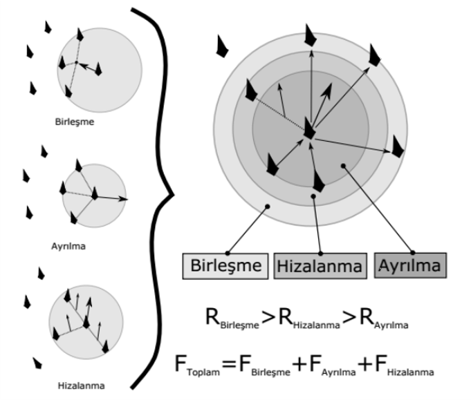
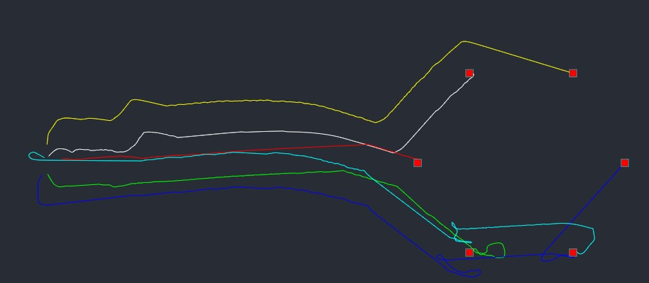
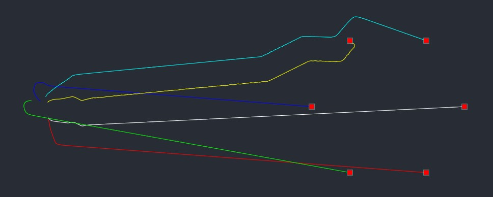
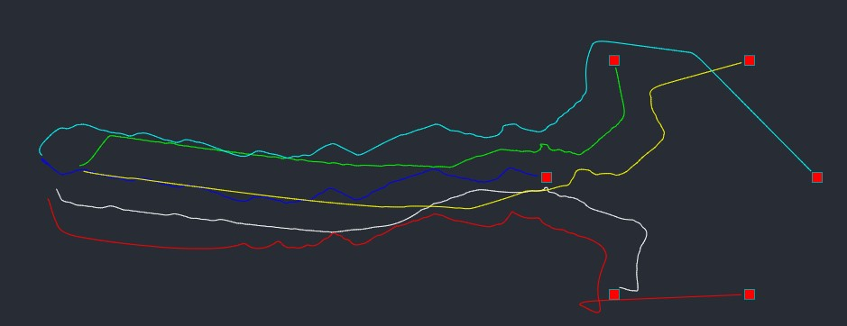
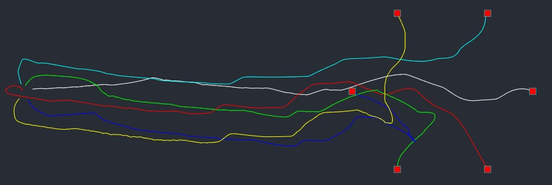
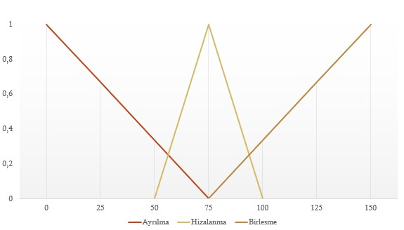
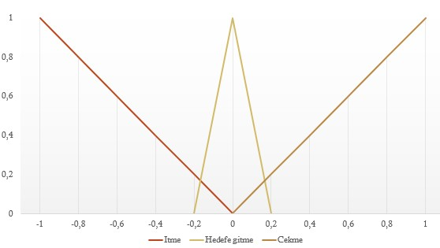
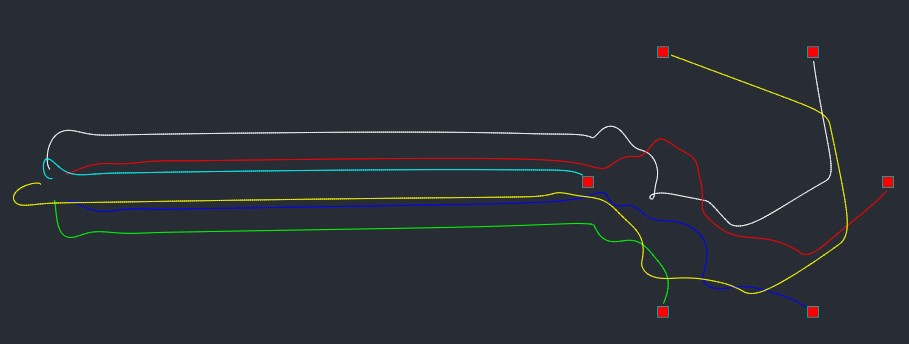
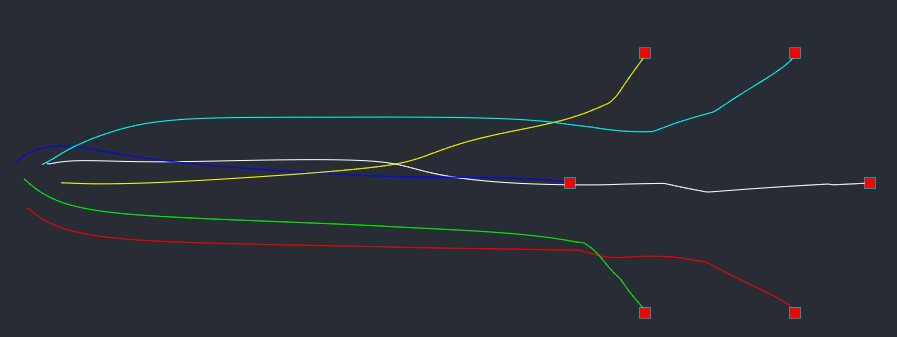

# Bulanık Boid Algoritması

Boid algoritması, çok sayıda basit robotların sürü halinde hareket edebilmelerini sağlamaktadır. Bu algoritmanın 3 temel kuralı vardır:

- Birleşme kuralı, birleşme alanı içinde algılanan komşuların konumlarına göre merkezlerine doğru hareketi sağlayacak bir çekme kuvvet vektör oluşturmadır. Bu kural sürüye dâhil olma veya yaklaşma için kullanılmaktadır.

- Hizalanma kuralı, ise birleşme ve ayrılma bölgeleri arasında tanımlı olan bir alanda sürünün aynı yönde veya aynı hedefe doğru hareket etmesi için komşuların hız vektörüne uyum sağlaması için oluşturulan bir kuvvet vektörüdür.

- Ayrılma kuralı, ayrılma için tanımlanmış bölgede algılanan komşu bireylerden uzaklaşma amacıyla oluşturulan itme kuvvet vektörüdür.

Robotların boid bölge sınırları hareket yeteneği, sensörlerin algılama mesafesi, kullanıcının sürüdeki istediği sıklık, haberleşme kapsama alanı vb. parametrelere bağlı olarak değişmektedir.

Boid algoritmasıyla ilgili daha fazla bilgiye buradan ulaşabilirsiniz:

[Ben Eater | Boid Algoritm](https://eater.net/boids)

[Ben Eater | Boids | Github](https://github.com/beneater/boids)

[Boids | Pseudocode](http://www.kfish.org/boids/pseudocode.html)

https://dergipark.org.tr/tr/pub/politeknik/issue/49017/481177

Bu çalışma aşağıdaki makaleden yola çıkarak hazırlanmıştır:

[Seçkin A.Ç., Özek A. ve Karpuz C., “Çoklu robotlarda işbirlikli davranışların karşılaştırılması ve bulanık mantık yaklaşımı”, Politeknik Dergisi, 22(4): 913-919, (2019).](https://dergipark.org.tr/tr/pub/politeknik/issue/49017/481177)

### Karşılaştırma

Robotlarda bireysel, normal sürü ve bulanık sürü davranışının, yarışarak hedefe varma ve önceden belirli hedefe varma davranışının etkilerini gözlemlemek için altı durum incelendi.

|              | Yarışarak | Önceden belirlenen hedef |
| ------------ | --------- | ------------------------ |
| Bireysel     | State 1   | State 2                  |
| Normal sürü  | State 3   | State 4                  |
| Bulanık Sürü | State 5   | State 6                  |

Karşılaştırırken amacımız robotların kısa süre içinde, güvenli şekilde hedeflerine varmasıdır.

##### State 1: Bireysel Yarışarak Hedeflere Ulaşması

Robotlarda çarpışmayı önlemek için boid algoritmasının sadece ayrılma kuralı uygulanır. Robotlar en yakın hedefe varmaya çalışır.

**Süre:** 0:45.00

##### State 2: Bireysel Robotların Önceden Atanmış Hedeflere Ulaşması

Robotlarda çarpışmayı önlemek için boid algoritmasının sadece ayrılma kuralı uygulanır. Robotlar önceden belirli hedefe varmaya çalışır.

**Süre:** 0:29.70

##### State 3: İşbirlikli Robotların Hedeflere Yarışarak Ulaşması

Robotlarda boid algoritmasının  ayrılma kuralı ile hizalanma ve birleşme kuralı da uygulanır. Robotlar en yakın hedefe varmaya çalışır.

**Süre:** 0:36.4

##### State 4:  İşbirlikli Robotların Önceden Atanmış Hedeflere Ulaşması

Robotlarda boid algoritmasının  ayrılma kuralı ile hizalanma ve birleşme kuralı da uygulanır. Robotlar önceden belirli hedefe varmaya çalışır.

**Süre:** 0:34.1

##### Bulanık Mantığın uygulanışı

Robotlar arası bölgeler mesafeye göre aşağıdaki grafikteki gibi bulanıklaştırılmıştır.

Aşağıdaki grafiğe göre berraklaştırma işlemi yapılır. Çıkan değerler boid kuralları uygulanırken vektörlerin kat sayıları olur.

##### State 5: Bulanık İşbirlikli Robotların Yarışarak Hedeflere Ulaşması

Robotlarda bulanık ayrılma, hizalanma ve birleşme kuralı uygulanır. Robotlar yarışarak hedefe varmaya çalışır.

**Süre:** 0:44.8

##### State 6: Bulanık İşbirlikli Önceden Atanmış Hedeflere Ulaşması

Robotlarda bulanık ayrılma, hizalanma ve birleşme kuralı uygulanır. Robotlar önceden belirli hedefe varmaya çalışır.

**Süre:** 0:29.3